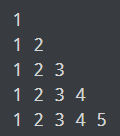
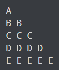
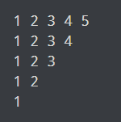

# C++ Programs To Create Pyramid and Pattern
ver1.cpp:
Program to print half pyramid using 

ver2.cpp:
Program to print half pyramid a using numbers

ver3.cpp:
Program to print half pyramid using alphabets

ver4.cpp:
Program to print Inverted half pyramid using *

ver5.cpp:
Program to print Inverted half pyramid using numbers

